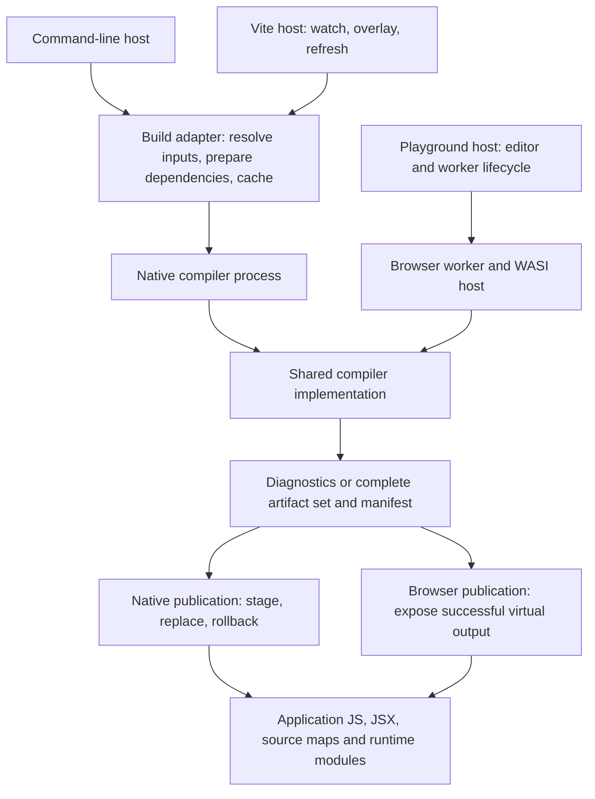
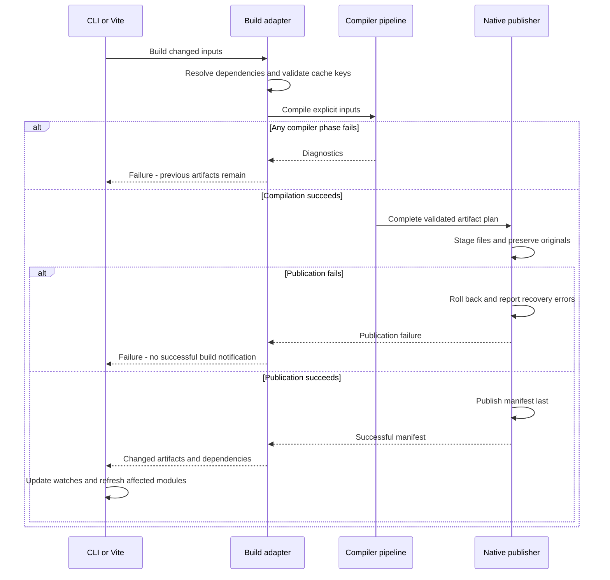

# Architecture

How rust-js is put together: what each part does, what it may not do, and
where a change goes. The [design decisions](README.md) say why each part
works the way it does; this page says where it is. The boundaries below
are executable: [architecture.test.ts](../test/architecture.test.ts)
checks each one. What isn't built yet is at [the end](#not-yet), and the
[roadmap](../ROADMAP.md) tracks it.

## Policies

### One pinned Rust toolchain per release

Each rust-js release supports one exact Rust toolchain. The current pin is
the stable release `1.99.0`; [rust-toolchain.toml](../rust-toolchain.toml) is the source of
truth. This follows [ADR 0003](decisions/0003-pin-nightly-toolchain.md) and
[ADR 0109](decisions/0109-stable-release.md).

The compiler uses rustc's internal APIs and THIR, so a toolchain upgrade is a
deliberate compatibility change. Update the pin, adapt frontend and lowering
assumptions, rebuild matching dependencies and WASI artifacts, and run the
conformance, snapshot, and native/browser parity suites together. Compiler
metadata and caches must not be reused across incompatible toolchains.

Older application source may compile under the pinned frontend within our
supported language subset. That does not promise the behavior or diagnostics
of an older rustc. Rust editions and compiler versions are separate concerns.
Users needing an earlier toolchain use a matching earlier rust-js distribution.

Simultaneous support for multiple rustc versions is outside this architecture's
current scope. Do not add version-specific frontend adapters or another typed
Rust representation solely for hypothetical multi-version support.

### Modern JavaScript output; downstream compatibility

rust-js emits readable modern, standardized JavaScript, ES modules, and JSX
where requested by the program. It does not offer separate ES6, ES8, or
browser-specific code-generation modes. There is no internal JavaScript
compatibility or downlevel-transformation phase.

The application configures its JavaScript toolchain to transform syntax, process
JSX, bundle modules, and provide the runtime polyfills its deployment targets
need. Syntax transformation alone does not supply missing runtime APIs. Both
generated application code and emitted runtime helpers must pass through this
pipeline, with source maps preserved back to the Rust source.

| Responsibility | Owner |
| --- | --- |
| Rust evaluation order, copying, overflow, representations, and errors | rust-js |
| Readable modern JS/JSX, ES modules, semantic helpers, and source maps | rust-js |
| Browser targets, syntax lowering, JSX transformation, and module conversion | Application's JavaScript toolchain |
| Compatibility polyfills, bundling, minification, and code splitting | Application's JavaScript toolchain |

Modern output is a documented release contract, not permission to emit arbitrary
experimental syntax. Each release must declare its syntax baseline, required
runtime capabilities, and supported environments for direct execution without
transformation. New requirements need compatibility tests and release notes.

Not every capability can be supplied by ordinary downlevel transforms or
polyfills. For example, helpers currently use native BigInt arithmetic. The
supported deployment configuration must preserve those semantics or exclude
environments that cannot provide them. Choosing an old syntax target alone is
not proof of runtime compatibility.

Integration tests exercise representative downstream production builds and their
source maps. The playground must either run on an environment satisfying the
direct-execution contract or apply the same downstream transformations before
running generated programs.

## Hosts

Native and browser builds use the same compiler implementation. Hosts supply
inputs and consume results; they do not implement Rust semantics. The browser
uses a worker running the WASI compiler, with a supported virtual filesystem
and dependency set.



The native build adapter resolves the supported Cargo dependency graph, features,
bindings, compiler version, and toolchain. It produces explicit compilation
inputs. The browser host supplies equivalent inputs for its supported scope;
arbitrary Cargo build scripts and procedural macros are not implicitly promised
in a browser.

Vite owns rebuild scheduling and development feedback. It does not know where
binding source files live or how to build React or Serde metadata. Installed
compiler and binding packages can be used without a source checkout.

## The pipeline

rust-js reuses rustc for everything up to type checking and borrow
checking, as ReScript reuses OCaml's, and writes JavaScript from rustc's
THIR:

```text
 .rs ─► rustc: parse, resolve, type check, borrow check ─► THIR (copied out)
                                                              │
 ┌─ front end: src/lower.rs, src/lower/ ──────────────────────▼──────────────┐
 │  analysis  ─► what the whole crate is: dictionaries, drops, laziness ...  │
 │  pipeline  ─► each function, lowered with its own FnCx                    │
 │  THIR expression ─► expr() or stmt() ─► our JS AST (src/js.rs)            │
 └──────────────────────────────────┬────────────────────────────────────────┘
                                    ▼  owned output: no rustc types from here
 reachability, link, names, prepare (readability), output, publish
                                    ▼
 printing: to_oxc.rs ─► oxc ─► format.rs ─► .js + .js.map
```

Four layers. The arrows above are the order work happens in; a module uses
only the layers its row allows. The architecture test resolves each
module's `crate::` and `super::` paths and checks them against this table:

| Layer | Modules | May use | May not |
|---|---|---|---|
| Driver | `main.rs`, `cargo.rs` | every layer | |
| Front end | `lower.rs`, `lower/`, `jsx_syntax.rs`, `jsx_syntax/` | the front end, owned output | publish files; link |
| Owned output | `js.rs`, `program.rs`, `link.rs`, `reachability.rs`, `names.rs`, `prepare.rs`, `output.rs`, `publish.rs`, `manifest.rs`, `library.rs`, `runtime.rs`, `settings.rs`, `hooks.rs`, `paths.rs` | owned output | use rustc |
| Printing | `to_oxc.rs`, `format.rs` | printing, owned output | be bypassed: only they use oxc |

Two owned modules start printing, and are named as its exceptions:
`output.rs` prints each module it plans (`to_oxc.rs`), and `hooks.rs`
formats what a hook returns (`format.rs`). Another exception is a change
to this table and its test. Within a layer, no modules use each other in
a cycle: a helper more than one needs, as `paths.rs`'s, has its own home.

**Who owns each phase.** A failure at any phase produces diagnostics and
prevents publication; rustc remains the authority on Rust validity. THIR
is captured before rustc's analysis consumes it, but capturing a body
doesn't authorize emitting it: lowering starts only once the analysis gate
passes.

| Owner | Owns | Does not own |
| --- | --- | --- |
| Driver | Compiler invocation, rustc callbacks, phase sequencing, diagnostic gates | Feature lowering or Vite behavior |
| Syntax expansion | JSX-to-Rust syntax translation and source provenance | Bypassing Rust checks or deciding JS representations |
| Analysis | Definition indexes, validated bindings, trait and representation facts, item names and reserved imports | Mutable function state, emission, filesystem writes |
| Lowering pipeline | Work scheduling, demand-driven codecs, Rust-specific retention policy and module assembly | Import alias resolution, runtime dependency closure, publication |
| Lowering | Rust-to-JS semantics, control flow, places, copying, evaluation order | Formatting, output paths, installation |
| Linker | Symbol resolution, collision-free aliases, runtime dependency closure, completed linked output | Rust-specific retention policy, re-lowering bodies or changing expression semantics |
| Runtime catalog | Helper implementations, exported names, transitive dependencies | Rust syntax recognition or host setup |
| Preparation | Readability transformations that preserve evaluation regions | New language semantics or predicted printer indentation |
| Printer adapter | oxc conversion, formatting, source-map generation | Rust type decisions, choosing runtime imports, or artifact publication |
| Artifact planner | Filenames, collisions, manifest, each module's runtime imports, complete generated bytes, and which files an older build wrote are stale: in its output's directory, neither written nor read now, still as written by fingerprint | Rust semantics or editor lifecycle |
| Publisher | Carrying out the plan: staging, unchanged-file preservation, removing the files the plan calls stale, failure recovery | Compiler transformations, or deciding what's stale |

## Inside the front end

The front end turns one function's THIR into JS. `FnCx` holds what that
takes. Its state is grouped by concern, each group read and written only
by the module that owns it, which others ask: what a generic item is given
(`Given`), what writing to a `Formatter` knows (`display::Writing`), what
iterator chains are beyond their types (`iterators::Chains`), which locals
are stepped through (`iterators::Stepping`), what the `&mut`s to values JS
can't change in place are (`mut_refs::MutRefs`, in `Locals`), what walks of
types found (`TypeWalks`), and what's dropped where (`drops::DropState`).

State follows three lifetimes:

- **Compilation:** immutable definition and representation facts, shared by all
  functions. Any analysis cache has an explicit owner and input key.
- **Function:** local bindings, allocated names, scopes, and accumulated symbol
  and helper dependencies. Nested function contexts inherit only what they need
  and return their dependencies explicitly.
- **Expression invocation:** evaluated operands, saved struct fields, branch
  statements, and destination information. These are local values or explicit
  arguments, never a single shared scratch slot on the function context.

An expression result makes its prerequisite statements and resulting value
explicit. The common sequencing engine evaluates operands in Rust order and
captures earlier values when later prerequisites could change them. Branch,
loop, closure, and short-circuit prerequisites remain inside their own execution
regions. A statement destination remains explicit: return, assign, or discard.

Operation classification is side-effect-free. It identifies a supported
operation and its representation requirements before emission. Prefer rustc
identities and diagnostic items; unavoidable library-layout assumptions live in
one recognition boundary and have toolchain-upgrade tests.

Its modules come in four kinds.

**Questions, which emit nothing.** They read THIR and types, and answer.
Each is checked to stay that way.

| Module | Answers |
|---|---|
| `recognition.rs`, `recognition/` | Which std function or method a call is, a `Std`: `classify` asks what's known by identity, then a trait's method, then a type's own |
| `body_queries.rs` | What a body has: `for` loops, `.await`, places, stepped iterators |
| `effects.rs` | What evaluating an expression, or calling a closure, can do that can be seen |
| `drops/types.rs` | What dropping a type runs, and what a pattern moves, asked through a `DropQuery`: types, the crate's facts, which type parameters have drops, and the bounds of the dictionaries given, never `FnCx` |
| `drops/facts.rs` | What a body owns and moves, found before it's lowered, from a `DropQuery` and the body's THIR |
| `analysis.rs`, `analysis/` | What the whole crate is, before any function is lowered: what it refuses, the names its items have in JS, the types it changes in place, its drops' and `Debug`'s needs |
| `shortcuts.rs` | Nothing of its own: `self.is_map(ty)` for `self.recognition().is_map(ty)`, each question answered in `recognition.rs` |

**Lowering of Rust's constructs.**

| Module | Lowers |
|---|---|
| `lower.rs` | Dispatch of expressions and statements, destinations, evaluation order |
| `bodies.rs` | Functions, closures and nested bodies: setup, captures, entry and exit |
| `patterns.rs` | Bindings, destructuring, `match`, `if let` and let-chains |
| `loops.rs` | Loops and labels |
| `places.rs` | Reading, borrowing and writing places, and `mem::swap` and `replace` of them |
| `mut_refs.rs` | A `&mut` to a value JS can't change in place, given to a call or given back by one: a box, the place, or a std call's items |
| `drops.rs` | Destructors: scopes, flags, temporaries, and the JS that drops |
| `representation.rs` | How each Rust value is represented: its shape, an `Option`'s payload, a cell, a number |
| `copies.rs` | When a value is copied: where it's read, if something changes one of its kind in place |
| `support.rs` | What rust-js can represent, and the error where a value it can't is made or bound |
| `aggregates.rs` | Structs, variants and tuple structs made, by fields or a struct update, and constructors as values |
| `results.rs` | `?`, and the `From` that converts its error |
| `items.rs` | References to items: what a function or a binding is in JS, whether it's the crate's, which impl a call runs |
| `traits.rs`, `std_impls.rs`, `ordering.rs` | Traits: dictionaries, evidence, `dyn`, calls of an impl's method; `Clone`, `Default`, `PartialEq`, `Ord` |
| `display.rs`, `format_args.rs`, `format_spec.rs` | `Display` and `Debug`, `format_args!`, placeholders' options |
| `serde.rs`, `serde/` | serde's derives and serde_json |
| `jsx.rs`, `jsx_api.rs`, `bindings.rs` | JSX, and bindings to JavaScript |
| `library.rs`, `sources.rs`, `pipeline.rs` | Libraries' contracts, source files, and the crate as a whole |

**Who owns what.** A concept that more than one module needs has one
module that owns it: its state, the questions about it, and the JS it's
written as, which the others ask for. [architecture.test.ts](../test/architecture.test.ts)
holds the ones below to it, and `bun run architecture` shows where each
stands: what's read outside its owner, and how much each module knows of
the rest.

| Concept | Owner | What the others ask |
|---|---|---|
| What dropping runs, and where | `drops.rs`, `drops/` | `drop_value`, `moved`, `temporary`, `enter_body_drops` |
| Whether a value is a JS iterator or an array | `iterators.rs` | `is_lazy_value`, `mark_lazy_chain`, `dyn_iterator` |
| Locals stepped through, `$iter`s, and a generic iterator as a JS iterator (ADRs 0061, 0071) | `iterators.rs` | `steps_through`, `stepped_value`, `is_stepping`, `js_iterator`, `stepped_items` |
| `&mut`s to values JS can't change in place | `mut_refs.rs` | `is_boxed`, `is_alias`, `slot`, `is_item_call` |
| Writing to a `Formatter` | `display.rs` | `written`, `formatter_answer`, `with_dyn_debug` |
| What a function or a binding is in JS | `items.rs` | `fn_ref`, `js_ref`, `resolve_instance` |
| Dictionaries and evidence: where a given one is, by its bound (`EvidenceQuery`), and its JS | `traits.rs` | `dictionary`, `evidence_for`, `has_evidence`, `impl_call` |
| What a generic function was given: dictionaries, a copied default's arguments, type facts (ADRs 0049, 0145) | `traits.rs` | `in_impl_terms`, `given_evidence`, `given_type_fact`, `resolve_self_instance`, `enter_default` |
| The box of a `Some` that looks like `None` (ADR 0051) | `options.rs` | `some`, `some_value`, `some_literal`, `is_some_box` |
| When a value is copied | `copies.rs` | `copy_if_needed`, `contains_mutated` |
| A cell, a lock, and the place its guard names (ADRs 0025, 0144) | `cells.rs`; `places.rs` for the place | `ref_place`, `guarded_cell` |
| Which std function a call is | `recognition.rs` | `classify`, and its answers through `shortcuts.rs` |
| Std's names: which std item a type, trait or function is | `recognition.rs` | `StdItem`, `is_std_type`, `is_std_def`, `std_item`, `trait_method` |

**Calls.** A call is lowered by `calls.rs::call`, a short dispatcher;
what a function is in JS is `items.rs`'s, and a `&mut` given to one
`mut_refs.rs`'s:

```text
 call(f, args)
   ├─ the crate's own function, a binding, a closure, a trait's method
   │     └─► special_call
   └─ one of std's: classify(f) = Some(known)
         └─► std_call(known): what every std call must keep (drops, Option boxing)
               └─► the domain that knows it, asked in turn:
                     vecs.rs  options.rs  cells.rs  numbers.rs
                     iterators.rs  text.rs  format_args.rs
                     maps.rs  ranges.rs  combinators.rs  serde/value.rs ..
```

Each domain's function lowers its `Std` variants and says `None` to the
rest. `std_call`'s own match names every variant a domain lowers, so a new
`Std` variant is a compile error until something lowers it.

**Iterators.** Whether a value is a JS iterator or an array is one
question, `iterators::is_lazy_value`: its type says so (an endless source,
an iterator of the crate's own), or a chain's consumer made it so, when a
stage does what can be seen ([ADR 0139](decisions/0139-lazy-chains.md)).
Only `iterators.rs` reads either answer.

**Runtime helpers.** The JS that generated code imports from
`@rust-js/runtime`: each is a file, `src/runtime/<name>.js`, which
`runtime.rs` names and orders, and the package is made from them
([ADR 0103](decisions/0103-runtime-package.md)). Lowering asks for the
helpers a module needs; `output.rs` imports the ones its prepared tree
reads, and the printer is given that list.

## Owned output and source origins

The JS tree remains small and independent of rustc and oxc. Lowering may use rustc
types internally, but completed phase outputs do not expose `TyCtxt`, `DefId`, or
borrowed rustc source files to printing or publication.

Symbolic references use explicit symbol identities rather than special strings
masquerading as JavaScript identifiers. Linking resolves them into ordinary
names. The linked output contract forbids unresolved references; validate that
invariant before printing.

Source origins use compiler-owned file identities and spans. They retain the
origin of copied trait bodies, macro expansions, and cross-module code, so output
is not restricted to one source file per generated module. JSX expansion and
formatting preserve or explicitly remap this provenance.

Use named phase outputs to make ownership visible: captured input, analyzed
facts, lowered modules, linked modules, and artifact plan. Introduce only the
types needed to enforce real invariants; avoid parallel copies of every tree.

## Libraries

A library rust-js compiles is JS of its own, with a versioned manifest of
what crosses to its consumers: exported representations, trait evidence,
symbol identities, and runtime ABI
([ADR 0100](decisions/0100-separate-crates.md)); Cargo runs each crate's
compilation ([ADR 0101](decisions/0101-cargo-workspace-wrapper.md)). rustc
metadata alone is not a substitute for JavaScript linkage information. A
manifest from another build, or a library a consumer wasn't told of, is
refused. Compiled output is reusable only when its source inputs,
dependencies, features, target options, compiler, toolchain, and ABI
versions agree.

## Publication

A versioned manifest is the contract between compiler and hosts. Named producer
types and validating consumers agree on sources, modules, imports, artifact
paths, fingerprints, and compiler/ABI identity. Hosts reject incompatible
versions with an actionable error. Virtual paths are remapped as structured
fields, never by replacing text inside serialized JSON.



Each host keeps the same split: what's stale is the plan's to decide, and
the publisher's to remove. Natively, `output.rs` decides and `publish.rs`
removes; the WASI host's `publishArtifacts` decides by the native rules,
from the manifest, and its `commit` removes; and a Cargo build's copies
beside each module's Rust are decided by `writeInSource`, from a ledger of
what they are in place of a manifest, and published by the same `commit`
([ADR 0101](decisions/0101-cargo-workspace-wrapper.md)).
Native multi-file publication provides rollback for ordinary I/O failures; it
does not claim crash-atomic replacement across all files. Cleanup removes only
obsolete artifacts still matching their recorded ownership fingerprints.
Browser compilation writes into a fresh virtual filesystem and exposes the
result only after success. Browser and native results obey the same semantic
contract despite these different publication mechanisms.

The playground's execution frame is a separate trust boundary from its compiler
worker and editor. Untrusted programs run in an isolated origin or appropriately
sandboxed frame, with validated messages and run identities. Worker cancellation
and preview recovery are host responsibilities.

## Where the code is

One compiler crate, whose module visibility and owned phase outputs keep
the boundaries; packages split only when independent reuse, dependency
isolation, or release needs justify it. Only the linker can construct the
`Linked` value artifact planning requires. Build hosts consume the manifest
instead of inferring compiler output.

| Responsibility | Code |
| --- | --- |
| Driver and syntax | `src/main.rs`, `src/jsx_syntax.rs` |
| Analysis and lowering | `src/lower/analysis.rs`, `src/lower/pipeline.rs`, `src/lower.rs`, `src/lower/` |
| Linking and runtime | `src/link.rs`, `src/names.rs`, `src/runtime.rs`, `src/runtime/` |
| JS tree and presentation | `src/js.rs`, `src/prepare.rs`, `src/to_oxc.rs`, `src/format.rs` |
| Owned modules and source origins | `src/program.rs`, `src/lower/sources.rs` |
| Artifact planning, manifest and publication | `src/output.rs`, `src/manifest.rs`, `src/publish.rs` |
| Build adapter and native host | `tooling/build.js`, `tooling/manifest.js`, `vite-plugin/index.js` |
| Browser host | `wasm/web/compile-rust.ts`, `tooling/publish.js`, `wasm/web/compiler-client.js`, `wasm/web/compiler-worker.js`, `wasm/web/rust/compiler.rs` |

## Where a change goes

A std function or method rust-js doesn't know yet:

1. **Recognize it**: a `Std` variant, and where `classify` finds it, in
   `recognition.rs` or `recognition/methods.rs`.
2. **Lower it** in its domain's function: `vecs.rs` for a `Vec`'s, `text.rs`
   for a string's, and so on. If it needs a runtime helper, add
   `src/runtime/<name>.js` and name it in `runtime.rs`.
3. **Prove it**: a corpus case in `test/corpus/`, compared with native Rust,
   and, of numbers, strings or chars, its row in the boundary matrices,
   `scripts/matrix.ts` ([ADR 0182](decisions/0182-boundary-matrices.md));
   mutations in its module's list in `scripts/mutations/`, each a bug its
   tests must catch;
   and a design decision in `docs/decisions/` if it's a new choice.

A new kind of value, construct or analysis goes with its kind above: a
question that emits nothing in a module of its own, checked as the others
are, and lowering in the module of the construct. Check the generated JS
reads as a person would write it, and run the checks
[CONTRIBUTING.md](../CONTRIBUTING.md) asks for before pushing, as
[AGENTS.md](../AGENTS.md) runs them.

## Not yet

The boundaries above hold today. These are targets the
[roadmap](../ROADMAP.md) tracks:

- **A numbered ES baseline and environment matrix** for running output
  directly, without the application's transformations (M1.1, M5.2).
- **General Cargo dependency graphs** compiled crate by crate (M8.1), and
  packaged releases beyond macOS arm64 (M4).
- **Measured budgets** for phase time, peak memory, generated bytes, and
  edit-to-refresh latency on application-scale workloads (M5.1).
- **Required checks:** the check workflow runs when started by hand, not on
  each push or pull request.
